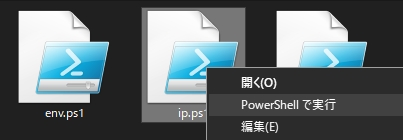

# Windows PowerShellで楽な自動化
自動化とは例えば1時間おきに自動的に書類を保存  
したり、ボタンを１つ押すだけ複数の作業をして  
くれるという、無駄の削減ということになります。  

従来の自動化なスクリプトはBATやVBSでしたが、  
今はNode.jsやPythonやGo言語やPowerShellです。  
しかしPowerShell以外は専門的で習得がやや困難です。

Node.jsは需要が多く、Pythonは唯一AIとの連携が強く、  
Go言語はスマホのアプリも作れますが、PowerShellのみ  
WindowsにOSインストール直後から付属なので手軽です。

Windows上で自動処理などが出来るVBSは防犯上などから、  
廃止されるので、VBSのソースコードをChatGPTで簡単に  
置き換えも出来ますので、PowerShellから学ぶと効率が  
良いです。

VBSは廃止ですが、VBAはExcelとAIで連携で残るでしょう。  
事務系な一般的な業務はPowerShellとVBAということです。

## PowerShellは従来のシェルと違い高防犯です
初めてPowerShellでスクリプトを作成し、実行しようとすると  
「デジタル署名がされていないので実行できません」と英文で  
表示されますので、署名するか署名を無効にしても実行できる  
ようにしましょう。

署名をすると防犯上は良いのですが、開発段階では手間が  
かかるので、作成者アカウントなら無署名でも実行可に  
すると便利です。

### Set-ExecutionPolicy RemoteSigned
上記ののコマンドをPowerShallなどで入力すると、ローカルで  
作成した無署名の書類は実行できますが、インターネットから  
ダウンロードした身元不明な書類は防犯上、実行できません。

### PowerShallで実行するには右クリックします
ターミナルからコマンド入力しても実行はできますが、  
クリックして実行ができて、こちらの方が楽です。  

下図のように右クリックを1回するとメニューが出てきます。  
  
上図のメニューの上から２番目の「PowerShell で実行」  
を選ぶとPowerShellで作成書類が動作（実行）します。  

ダブルクリックをするとnotepadで編集できて、メニューの  
３番目の「編集」を選ぶとPowerShellの専用アプリで編集  
できます。

### Go言語でPC内のアプリを操作するコード
Go言語はPCアプリの操作はできないのでは？と思う人も  
いるかもしれませんが、下記のようにできます。  
Go言語は他と違い、速度が早いので大規模システムの  
自動化に向いていると思います。
```go
package main

import (
    "fmt"
    "os/exec"
)

func main() {
    // メモ帳 (Notepad) を起動する
    cmd := exec.Command("notepad.exe")
    err := cmd.Start() // コマンドを開始
    if err != nil {
        fmt.Println("エラー:", err)
        return
    }
    fmt.Println("メモ帳を起動しました")
}
package main

import (
    "fmt"
    "os/exec"
)

func main() {
    // メモ帳 (Notepad) を起動する
    cmd := exec.Command("notepad.exe")
    err := cmd.Start() // コマンドを開始
    if err != nil {
        fmt.Println("エラー:", err)
        return
    }
    fmt.Println("メモ帳を起動しました")
}

